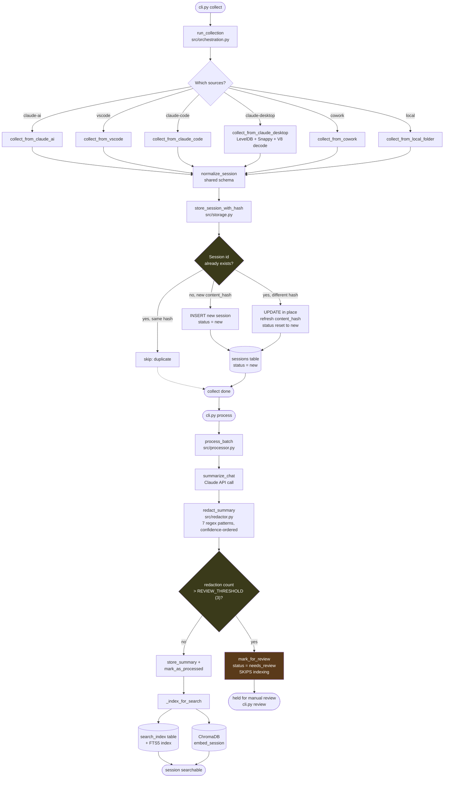
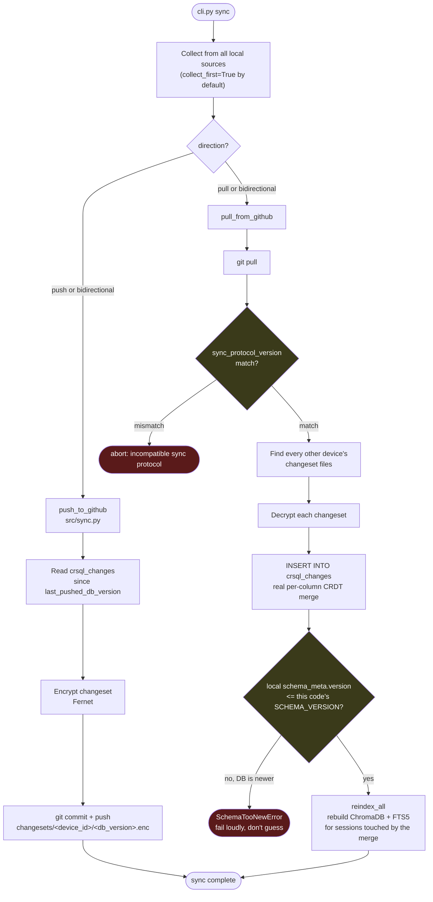

# Claude Search Library — Code Flow

Traced from the real source (`src/orchestration.py`, `src/storage.py`,
`src/processor.py`, `src/redactor.py`, `src/embedder.py`, `src/sync.py`),
not the high-level summary in CLAUDE.md's "Architecture at a Glance."
Two separate flows, since they run independently and conflating them
would hide the actual decision points in each.

## 1. Collect → Process (`cli.py collect` / `cli.py process`)

**Key decision points, not obvious from the module names alone:**
- `store_session_with_hash` doesn't just insert-or-skip — a same-`id`-different-hash
  case updates the existing row in place and resets `status` to `new` so it
  re-enters the processing queue (real bug fix, see CHANGELOG.md 2026-08-04).
- Redaction runs **before** anything is stored/indexed/embedded, not after
  — a session crossing the review threshold never reaches `search_index`
  or ChromaDB until a human clears it via `cli.py review`.

## 2. Sync (`cli.py sync`)

**Key decision points:**
- Push never sends whole rows — only the `crsql_changes` delta since this
  device's last push, one encrypted file per push.
- Pull's merge is real per-column CRDT (`INSERT INTO crsql_changes`), not
  a hand-written Last-Write-Wins comparison — two devices editing
  different fields of the same session both survive.
- Two independent compatibility guards, added for two different failure
  modes: `sync_protocol_version` catches an incompatible *wire format*
  between devices; `SchemaTooNewError` catches old code opening an
  already-migrated *local* database (see CHANGELOG.md's 2026-08-06 entry
  for why these are separate checks, not one).
